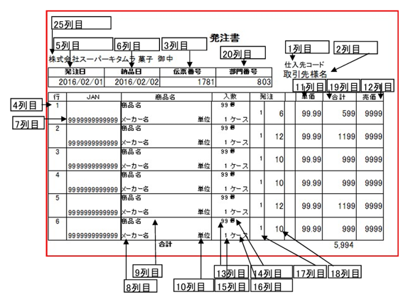

# CSVファイル仕様

[← 仕様書に戻る](../specification.md)

## 前提項目

| 項目 | 値 |
| --- | --- |
| ファイル名 | 固定（`eXXXX.csv`、Xは4桁の数字） |
| 文字コード | UTF-8 （BOMなし）|
| 改行コード | LF |
| データ形式 | CSV（各列をカンマで区切る） |
| 列名 | なし（ヘッダー行は存在しない） |
| 並び順 | 伝票番号、伝票行の昇順 |
| 合計行 | 伝票行が `999999999` の行 |

## 各列について

「変更」列が **可** となっている列のみ、取引先様側で内容を変更できます。それ以外の列は弊社側で確定した値のため、変更はできません。

| 列数 | 通常行 | 合計行 | 型 | 変更 | 備考 |
| --- | --- | --- | --- | --- | --- |
| 01列目 | 仕入先コード | 同左 | int | 不可 | |
| 02列目 | 仕入先名 | 同左 | varchar | 可 | |
| 03列目 | 伝票番号 | 同左 | int | 不可 | |
| 04列目 | 伝票行 | 999999999 | int | 不可 | |
| 05列目 | 発注日 | 同左 | date | 不可 | `YYYY/MM/DD` |
| 06列目 | 納品日 | 同左 | date | 不可 | `YYYY/MM/DD` |
| 07列目 | JANコード | 空欄 | varchar | 不可 | 8桁、13桁、12桁のいずれか |
| 08列目 | メーカー名 | 空欄 | varchar | 可 | |
| 09列目 | 商品名 | 空欄 | varchar | 可 | |
| 10列目 | 規格 | 空欄 | varchar | 可 | 内容量 |
| 11列目 | 単価 | 0 | float | 不可 | 税抜 |
| 12列目 | 売価 | 0 | int | 不可 | 税抜 | 
| 13列目 | 発注単位数 | 0 | float | 不可 | |
| 14列目 | 発注単位名 | 空白 | varchar | 不可 | |
| 15列目 | ロット数 | 0 | float | 不可 | |
| 16列目 | ロット名 | 空白 | varchar | 不可 | |
| 17列目 | 発注ロット数 | 発注ロット数合計 | float | 不可 | |
| 18列目 | 発注数量 | 発注数量合計 | float | 不可 | 発注単位数 × ロット数 × 発注ロット数 |
| 19列目 | 仕入金額 | 仕入金額合計 | int | 不可 | 発注数量 × 単価（小数点以下切り捨て） |
| 20列目 | 部門番号 | 同左 | int | 不可 | |
| 21列目 | 部門名 | 同左 | varchar | 不可 | 伝票には非表示 |
| 22列目 | クラス | 同左 | int | 不可 | 伝票には非表示 |
| 23列目 | クラス名 | 同左 | varchar | 不可 | 伝票には非表示 |
| 24列目 | 店舗番号 | 同左 | int | 不可 | |
| 25列目 | 店舗名 | 同左 | varchar | 不可 | |

## 伝票イメージ

## サンプルCSV

架空の取引先・商品による本仕様準拠のサンプルデータを用意しています。

- [サンプルCSV（架空データ）](../sample/1234.csv)
